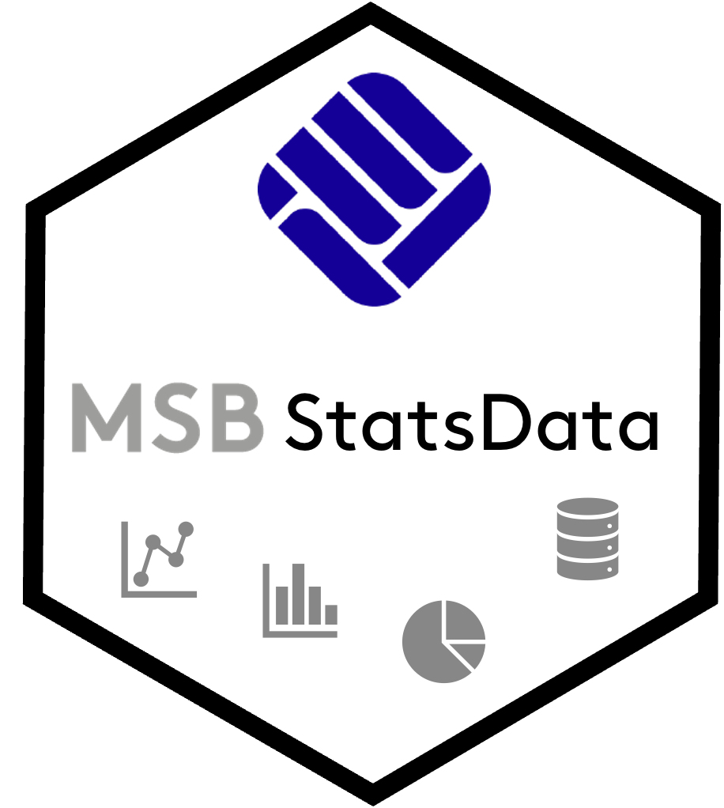

[](https://github.com/mchlbckr/MSBStatsData/actions/workflows/R-CMD-check.yaml)
[](https://github.com/mchlbckr/MSBStatsData/releases)
[](https://www.gnu.org/licenses/gpl-3.0)
[](https://CRAN.R-project.org/package=MSBStatsData)
[](https://cran.r-project.org/package=MSBStatsData)
[](https://cran.r-project.org/package=MSBStatsData)

# MSBStatsData 

`MSBStatsData` provides curated teaching datasets for statistics and data science
courses at the Muenster School of Business.

The package is designed for reproducible exercises and solutions in R, with data
that works well across core topics like frequencies, location and dispersion
measures, association, regression, and introductory time series analysis.

## Installation

```r
install.packages("MSBStatsData")

# development version
# install.packages("pak")
# pak::pak("mchlbckr/MSBStatsData")
```

## Quick start

```r
library(MSBStatsData)

data("cinema_visitors_100days")
head(cinema_visitors_100days)

data("de_energy_prices_monthly")
subset(
  de_energy_prices_monthly,
  series %in% c("electricity", "transport_fuels")
)[1:6, c("date", "series", "price_index_2015_100")]
```

## Selected datasets

- Core teaching data
  - `cinema_visitors_100days`
  - `bvb_final_rankings_1988_2022`
  - `website_dwell_time_grouped`
  - `checkout_service_times`
  - `research_ad_spending`
  - `environment_survey_eu10`

- Contingency-table data (aggregated + individual)
  - `union_agreement_satisfaction`
  - `union_agreement_satisfaction_individual`
  - `sport_activity_by_occupation`
  - `sport_activity_by_occupation_individual`
  - `florida_murder_sentencing`
  - `florida_murder_sentencing_individual`
  - `tv_viewing_by_gender`
  - `tv_viewing_by_gender_individual`
  - `car_brand_by_occupation`
  - `car_brand_by_occupation_individual`

- Muenster mobility data
  - `bike_sites_muenster`
  - `bike_counts_hourly_muenster_2025`
  - `bike_counts_hourly_muenster_2025_citywide`

- Public statistics snapshots (Germany/NRW)
  - `nrw_population_districts`
  - `de_election_states`
  - `de_energy_prices_monthly`

## Listing all datasets

```r
data(package = "MSBStatsData")
```

## Notes

- Most data objects are small and classroom-friendly.
- Where helpful, both aggregated and individual-level versions are provided.
- Data sources are documented in the respective dataset help pages (`?dataset_name`).
- GitHub releases may be ahead of the current CRAN version.
